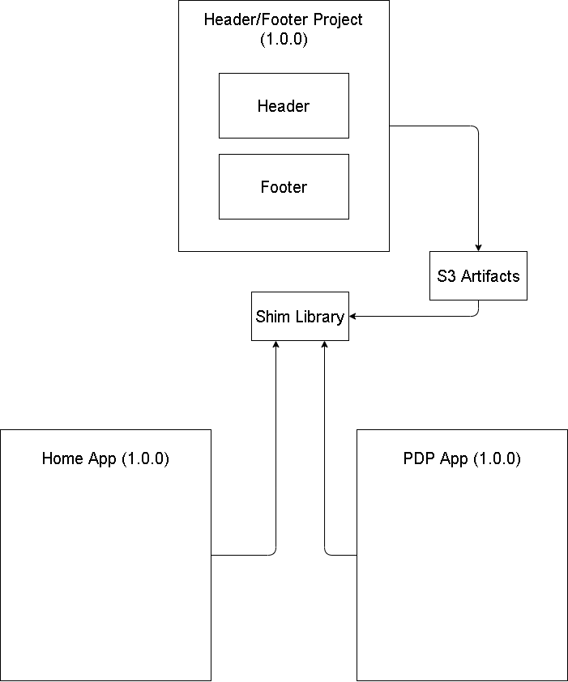

# micro-frontend-study

## Getting Started
```
npx create-mf-app

```

## Exposing Component
When you want to expose, Add component to `expose` object in 
`ModuleFederationPlugin` at `webpack.config.js`

```
exposes: {
  "./Header": './src/Header.jsx',
  "./Footer": './src/Footer.jsx',
},
```

## Using Expose Component
When you want to use exposed component, Add exposed component to `remotes` object in 
`ModuleFederationPlugin` at `webpack.config.js`

```
remotes: {
  home: 'home@http://localhost:3000/remoteEntry.js'
},
```

## Why Micro-Frontends


## Why Module Federation?
Module Federation is a feature that build into webpack 5. Anything that use webpack 5 can use Module Federation.

### NPM Library Architecture
The way that you save assets as npm library.



### Asset Store Architecture
DIY Micro Frontend. Use S3 as CDN for component


### Module Federation Architecture
With Module Federation you can share component out of another apps.


